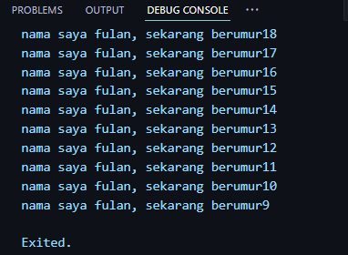

### Nama : Achmad Mufid
### Kelas : TI-3B
### NIM : 2241720159  

## Tugas

# Soal 1
Modifikasilah kode pada baris 3 di VS Code atau Editor Code favorit Anda berikut ini agar mendapatkan keluaran (output) sesuai yang diminta!
``` dart
void main() { 
   for (int i = 18; i > 8; i--) { 
    print('nama saya fulan, sekarang berumur${i}'); 
  } 
}
```
Output:



# Soal 2
Mengapa sangat penting untuk memahami bahasa pemrograman Dart sebelum kita menggunakan framework Flutter ? Jelaskan!

Memahami bahasa pemrograman Dart sangat penting sebelum menggunakan Flutter karena Dart merupakan dasar dari Flutter. Pemahaman Dart membantu dalam menulis kode yang efisien, memahami struktur proyek, memecahkan masalah dengan lebih efektif, dan mengikuti dokumentasi serta tutorial dengan lebih mudah. Dart memberikan fondasi yang kuat untuk mengembangkan aplikasi Flutter secara optimal.

# Soal 3
Rangkumlah materi dari codelab ini menjadi poin-poin penting yang dapat Anda gunakan untuk membantu proses pengembangan aplikasi mobile menggunakan framework Flutter.

Getting Started with Dart :
- Productive tooling: Alat analisis kode, plugin IDE, dan ekosistem paket besar.
- Garbage collection: Mengelola dealokasi memori, terutama untuk objek yang tidak digunakan.
- Type annotations (opsional): Keamanan dan konsistensi data aplikasi.
- Statically typed: Dart aman berkat type-safe dan type inference.
- Portability: Dart dapat dikompilasi ke JavaScript, ARM, dan x86.

Dart Syntax :
- Awalnya berfokus pada web, sekarang fokus pada mobile development dengan Flutter.
- Tujuan utama Dart adalah menggantikan JavaScript untuk meningkatkan ketahanan.
- Dart menawarkan performa terbaik dan alat modern untuk proyek berskala besar.
- Dart dirancang agar kuat dan fleksibel dengan type annotations opsional dan fitur OOP.

Dalam eksekusi kode Dart, terdapat dua mode utama, yaitu:

Kompilasi Just-In-Time (JIT):
Kode sumber dikompilasi sesuai kebutuhan, artinya saat dibutuhkan (Just in time). Dart VM memuat dan mengkompilasi kode sumber menjadi kode mesin asli (native) saat program dijalankan. Digunakan untuk menjalankan kode pada command line atau selama proses pengembangan aplikasi mobile. Fitur-fitur seperti debugging dan hot reload tersedia dalam mode ini, sangat membantu dalam pengembangan.

Kompilasi Ahead-Of-Time (AOT):
Kode Dart dan Dart VM dikompilasi sebelumnya sebelum aplikasi dijalankan. Dart VM berperan lebih seperti sistem runtime Dart, menyediakan garbage collector dan metode-metode native dari Dart SDK. Mode ini memberikan keuntungan performa yang signifikan dibandingkan dengan kompilasi JIT karena kode sudah dalam bentuk native. Namun, fitur-fitur seperti debugging dan hot reload tidak tersedia dalam mode ini.

Introducing the structure of the Dart language:
- Bahasa OOP didasarkan pada konsep objek yang menyimpan kedua data (disebut fields) dan kode (disebut methods).
- Operator tidak lebih dari method yang didefinisikan dalam class dengan sintaks khusus
- Operator penambahan dan pengurangan juga merupakan operator umum dan diimplementasikan pada angka

# Soal 4
Buatlah slide yang berisi penjelasan dan contoh eksekusi kode tentang perbedaan Null Safety dan Late variabel ! (Khusus soal ini kelompok berupa link google slide)

Berikut adalah link untuk slide penjelasan dan contoh eksekusi kode tentang perbedaan Null Safety dan Late variabel :
[Link Slide](https://www.canva.com/design/DAGPkygkyk8/a6nO0riqqmWgRnEhAr3JzQ/edit?utm_content=DAGPkygkyk8&utm_campaign=designshare&utm_medium=link2&utm_source=sharebutton)
