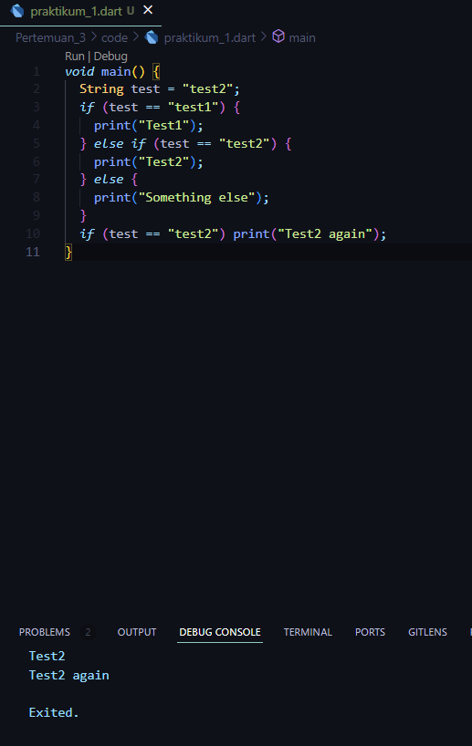
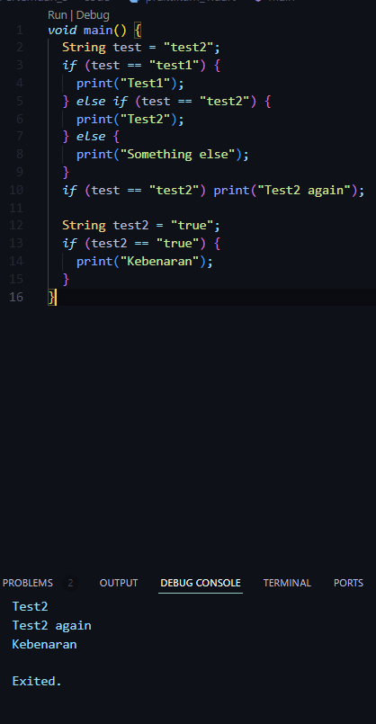
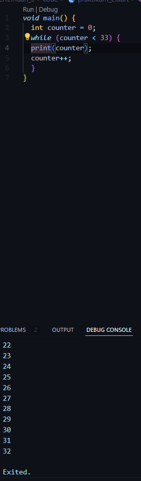
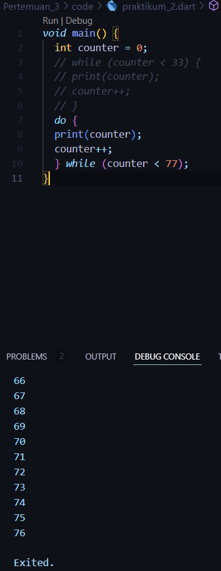
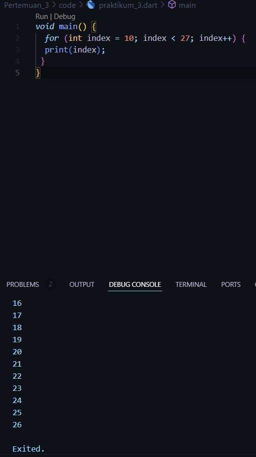
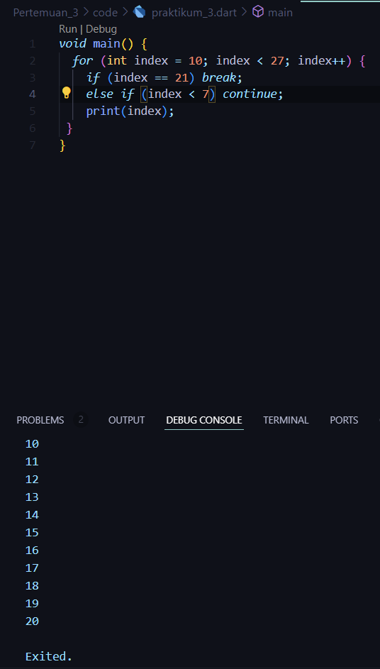
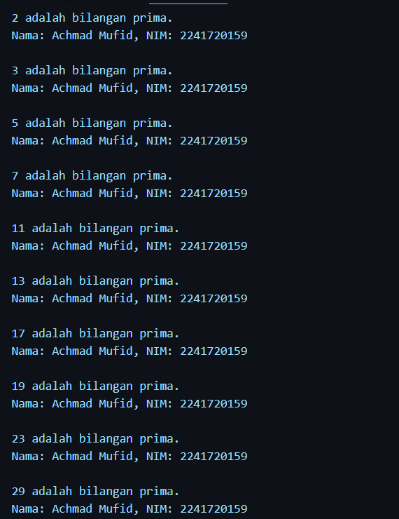

### Nama : Achmad Mufid
### Kelas : TI-3B
### NIM : 2241720159  

<br>

## Praktikum 1


Silakan coba eksekusi (Run) kode pada langkah 1 tersebut. Apa yang terjadi? Jelaskan!<br>
jawab :<br>
output yang dihasilkan adalah seperti yang ada di gambar karena kondisi yang memenuhi syarat ada di pengecekan yang kedua dan yang keempat.<br><br>



Apa yang terjadi ? Jika terjadi error, silakan perbaiki namun tetap menggunakan if/else.<br>
jawab :<br>

karena tipe data String tidak bisa dibandingkan langsung  dengan nilai true.<br>


## Praktikum 2

<br>
Silakan coba eksekusi (Run) kode pada langkah 1 tersebut. Apa yang terjadi? Jelaskan! Lalu perbaiki jika terjadi error.
<br>
jawab : <br>
penyebab kode error karena variabel counter belum terdefinisikan. kode diatas menggunakan operasi while untuk melakukan perulangan sampai dengan batas/kondisi yang sudah ditentukan.<br>


<br>
Apa yang terjadi ? Jika terjadi error, silakan perbaiki namun tetap menggunakan do-while.<br>
jawab : <br>
error yang terjadi sama seperti langkah yang sebelumnya yaitu variabel counter belum terdevinisikan.
<br>

## Praktikum 3

<br>
Silakan coba eksekusi (Run) kode pada langkah 1 tersebut. Apa yang terjadi? Jelaskan! Lalu perbaiki jika terjadi error.<br>
jawab :<br>

kode diatas hampir sama dengan kode yang ada di praktikum sebelumnya yaitu melakukan perulangan, bedanya yaitu pada kode dipraktikum ini menggunakan operasi for untuk perulanganya.<br>


<br>
Apa yang terjadi ? Jika terjadi error, silakan perbaiki namun tetap menggunakan for dan break-continue.<br>
jawab : <br>
Saat index mencapai 21, loop akan berhenti (break), sehingga tidak ada angka yang lebih besar dari 20 yang akan dicetak.
tapi kode diatas akan memiliki masalah karena kondisi index > 1 selalu benar (untuk setiap index dari 10 hingga 26), continue selalu akan dijalankan, menyebabkan perintah print(index); tidak pernah dieksekusi.
<br>

## Tugas
1. Silakan selesaikan Praktikum 1 sampai 3, lalu dokumentasikan berupa screenshot hasil pekerjaan beserta penjelasannya!<br>
jawab : <br>
[Praktikum_1](#praktikum-1)<br>
[Praktikum_2](#praktikum-2)<br>
[Praktikum_3](#praktikum-3)<br>

2. Buatlah sebuah program yang dapat menampilkan bilangan prima dari angka 0 sampai 201 menggunakan Dart. Ketika bilangan prima ditemukan, maka tampilkan nama lengkap dan NIM Anda.<br>
jawab : <br>
```dart
void main() {

  String nama = "Achmad Mufid";
  String nim = "2241720159";

  bool isPrime(int number) {
    if (number <= 1) return false;
    for (int i = 2; i <= number ~/ 2; i++) {
      if (number % i == 0) return false;
    }
    return true;
  }

  for (int i = 0; i <= 201; i++) {
    if (isPrime(i)) {
      print("$i adalah bilangan prima.");
      print("Nama: $nama, NIM: $nim\n");
    }
  }
}
```
<br>


3. Kumpulkan berupa link commit repo GitHub pada tautan yang telah disediakan di grup Telegram!

