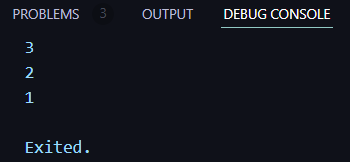
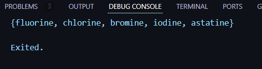
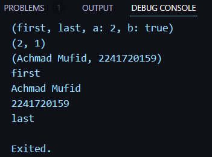

# Nama : Achmad Mufid

# Kelas : TI-3B

# NIM : 2241720159

<br>

## Praktikum 1

### Langkah 1
```dart
void main(){
    var list = [1, 2, 3];
    assert(list.length == 3);
    assert(list[1] == 2);
    print(list.length);
    print(list[1]);

    list[1] = 1;
    assert(list[1] == 1);
    print(list[1]);
}
```
### Langkah 2
Silakan coba eksekusi (Run) kode pada langkah 1 tersebut. Apa yang terjadi? Jelaskan!


<br>
Fungsi assert akan memastikan kondisi boolean pada ketentuan yang diminta bernilai true.

### Langkah 3
Ubah kode pada langkah 1 menjadi variabel final yang mempunyai index = 5 dengan default value = null. Isilah nama dan NIM Anda pada elemen index ke-1 dan ke-2. Lalu print dan capture hasilnya.

Apa yang terjadi ? Jika terjadi error, silakan perbaiki.
```dart
void main(){
    final List<dynamic> list = List.filled(5, null);
    list[1] = "Achmad Mufid";
    list[2] = "2241720159";

    print(list.length);
    print(list); 
}
```
List<dynamic> digunakan untuk memungkinkan elemen-elemen list memiliki tipe data yang berbeda.<br>
List diinisialisasi dengan panjang 5 dan nilai null pada setiap elemennya.<br>


## Praktikum 2

### Langkah 1
```dart
void main(){
    var halogens = {'fluorine', 'chlorine', 'bromine', 'iodine', 'astatine'};
    print(halogens);
}
```

### Langkah 2
Silakan coba eksekusi (Run) kode pada langkah 1 tersebut. Apa yang terjadi? Jelaskan! Lalu perbaiki jika terjadi error.


### Langkah 3
```dart
void main() {
  var halogens = {'fluorine', 'chlorine', 'bromine', 'iodine', 'astatine'};
  print(halogens);

  var names1 = <String>{};
  Set<String> names2 = {};
  Set<String> names3 = {}; 

  names1.add("Achmad Mufid");
  names2.add("2241720159");

  names3.addAll({"Achmad Mufid", "2241720159"});

  print(names1); 
  print(names2); 
  print(names3); 
}
```
Apa yang terjadi ? Jika terjadi error, silakan perbaiki namun tetap menggunakan ketiga variabel tersebut. Tambahkan elemen nama dan NIM Anda pada kedua variabel Set tersebut dengan dua fungsi berbeda yaitu .add() dan .addAll(). Untuk variabel Map dihapus, nanti kita coba di praktikum selanjutnya.

<br>
Fungsi .add() akan menambahkan 1 value saja (dalam konteks ini adalah String) sedangkan .addAll() akan menambahkan 1 atau lebih value berupa Set (dalam konteks ini adalah Set<String>).

## Praktikum 3

### Langkah 1
```dart
void main(){
    var gifts = {
  // Key:    Value
  'first': 'partridge',
  'second': 'turtledoves',
  'fifth': 1
};

var nobleGases = {
  2: 'helium',
  10: 'neon',
  18: 2,
};

print(gifts);
print(nobleGases);
}
```

### Langkah 2
Silakan coba eksekusi (Run) kode pada langkah 1 tersebut. Apa yang terjadi? Jelaskan! Lalu perbaiki jika terjadi error.


### Langkah 3
Tambahkan elemen nama dan NIM Anda pada tiap variabel di atas (gifts, nobleGases, mhs1, dan mhs2). Dokumentasikan hasilnya dan buat laporannya!

```dart
void main(List<String> args) {
  var gifts = {
  // Key:    Value
  'Nama': 'Achmad Mufid',
  'NIM': '2241720159',
  'first': 'partridge',
  'second': 'turtledoves',
  'fifth': 1
};

var nobleGases = {
  2: 'helium',
  10: 'neon',
  18: 2,
  19: 'Achmad Mufid',
  20: '2241720159',
};

var mhs1 = Map<String, String>();
gifts['first'] = 'partridge';
gifts['second'] = 'turtledoves';
gifts['fifth'] = 'golden rings';

var mhs2 = Map<int, String>();
nobleGases[2] = 'helium';
nobleGases[10] = 'neon';
nobleGases[18] = 'argon';

mhs1['Nama'] = 'Achmad Mufid';
mhs1['NIM'] = '241720159';

mhs2[1] = 'Achmad Mufid';
mhs2[2] = '241720159';

print(gifts);
print(nobleGases);
print(mhs1);
print(mhs2);
}
```

## Praktikum 4

### Langkah 1
```dart
void main(){
    var list = [1, 2, 3];
var list2 = [0, ...list];
print(list1);
print(list2);
print(list2.length);
}
```
### Langkah 2
Silakan coba eksekusi (Run) kode pada langkah 1 tersebut. Apa yang terjadi? Jelaskan! Lalu perbaiki jika terjadi error.<br>
Terjadi error karena tidak ditemukan variabel list1. Dapat diperbaiki dengan mengganti var list menjadi var list1 atau print(list1) menjadi print(list).


### Langkah 3
Tambahkan kode program berikut, lalu coba eksekusi (Run) kode Anda.
```dart
list1 = [1, 2, null];
print(list1);
var list3 = [0, ...?list1];
print(list3.length);
```
Apa yang terjadi ? Jika terjadi error, silakan perbaiki.<br>

Operator ...? (null-aware spread operator) digunakan untuk mencegah penyebaran objek null, tetapi hanya pada keseluruhan list yang null. Jika ada elemen null di dalam list, itu tidak akan ditangani oleh operator tersebut, sehingga tetap terjadi error.
Untuk mengatasi ini, bisa dengan mengganti elemen null dengan nilai yang valid, atau memfilter nilai null sebelum menyebarkannya.<br>
```dart
var list1 = [1, 2, null];
print(list1);
var list3 = [0, ...list1.where((element) => element != null)];
print(list3.length);
```

### Langkah 4
Tambahkan kode program berikut, lalu coba eksekusi (Run) kode Anda.
```dart
var nav = ['Home', 'Furniture', 'Plants', if (promoActive) 'Outlet'];
print(nav);
```
Apa yang terjadi ? Jika terjadi error, silakan perbaiki. Tunjukkan hasilnya jika variabel promoActive ketika true dan false.


### Langkah 5
Tambahkan kode program berikut, lalu coba eksekusi (Run) kode Anda.
```dart
var nav2 = ['Home', 'Furniture', 'Plants', if (login case 'Manager') 'Inventory'];
print(nav2);
```
Apa yang terjadi ? Jika terjadi error, silakan perbaiki. Tunjukkan hasilnya jika variabel login mempunyai kondisi lain.


### Langkah 6
Tambahkan kode program berikut, lalu coba eksekusi (Run) kode Anda.
```dart
var listOfInts = [1, 2, 3];
var listOfStrings = ['#0', for (var i in listOfInts) '#$i'];
assert(listOfStrings[1] == '#1');
print(listOfStrings);
```
Apa yang terjadi ? Jika terjadi error, silakan perbaiki. Jelaskan manfaat Collection For dan dokumentasikan hasilnya.

Collection for dalam Dart adalah fitur yang memungkinkan kita menggunakan loop for di dalam koleksi seperti list, set, atau map. Ini membuat penulisan kode lebih ringkas dan lebih mudah dibaca ketika kita ingin menghasilkan collection berdasarkan logika tertentu.

## Praktikum 5
### Langkah 1
Ketik atau salin kode program berikut ke dalam fungsi main().
```dart
var record = ('first', a: 2, b: true, 'last');
print(record)
```
### Langkah 2
Silakan coba eksekusi (Run) kode pada langkah 1 tersebut. Apa yang terjadi? Jelaskan! Lalu perbaiki jika terjadi error.

Akan menampilkan variabel record yang berupa Records.

### Langkah 3
Tambahkan kode program berikut di luar scope void main(), lalu coba eksekusi (Run) kode Anda.
```dart
(int, int) tukar((int, int) record) {
  var (a, b) = record;
  return (b, a);
}
```
Apa yang terjadi ? Jika terjadi error, silakan perbaiki. Gunakan fungsi tukar() di dalam main() sehingga tampak jelas proses pertukaran value field di dalam Records.<br>

Untuk menggunakan fungsi tukar() harus dipanggil di dalam main().
```dart
void main(List<String> args) {
  var record = ('first', a: 2, b: true, 'last');
  print(record);

  (int, int) tukar((int, int) record) {
    var (a, b) = record;
    return (b, a);
  }

  var record2 = (1, 2);
  var record3 = tukar(record2);
  print(record3);
}
```


### Langkah 4
Tambahkan kode program berikut di dalam scope void main(), lalu coba eksekusi (Run) kode Anda.
```dart
// Record type annotation in a variable declaration:
(String, int) mahasiswa;
print(mahasiswa);
```
Apa yang terjadi ? Jika terjadi error, silakan perbaiki. Inisialisasi field nama dan NIM Anda pada variabel record mahasiswa di atas. Dokumentasikan hasilnya dan buat laporannya!
<br>

Terjadi error karena variabel mahasiswa sebelumnya tidak memiliki value.
```dart
// Record type annotation in a variable declaration:
  (String, int) mahasiswa;
  mahasiswa = ('Achmad Mufid', 2241720159);
  print(mahasiswa);
```


### Langkah 5
Tambahkan kode program berikut di dalam scope void main(), lalu coba eksekusi (Run) kode Anda.
```dart
var mahasiswa2 = ('first', a: 2, b: true, 'last');

print(mahasiswa2.$1); // Prints 'first'
print(mahasiswa2.a); // Prints 2
print(mahasiswa2.b); // Prints true
print(mahasiswa2.$2); // Prints 'last'
```
Apa yang terjadi ? Jika terjadi error, silakan perbaiki. Gantilah salah satu isi record dengan nama dan NIM Anda, lalu dokumentasikan hasilnya dan buat laporannya!
```dart
var mahasiswa2 = ('first', a: "Achmad Mufid", b: 2241720159, 'last');

print(mahasiswa2.$1);
print(mahasiswa2.a);
print(mahasiswa2.b);
print(mahasiswa2.$2);
```


## Tugas
1. Silakan selesaikan Praktikum 1 sampai 5, lalu dokumentasikan berupa screenshot hasil pekerjaan Anda beserta penjelasannya!
2. Jelaskan yang dimaksud Functions dalam bahasa Dart!<br>
Jawab : <br>
Functions di Dart adalah blok kode yang dapat dipanggil dan dieksekusi untuk menyelesaikan tugas tertentu. Mereka bisa menerima input (parameter) dan mengembalikan output (nilai). Dart mendukung berbagai fitur dalam function seperti parameter opsional, anonymous functions, dan closures.
3. Jelaskan jenis-jenis parameter di Functions beserta contoh sintaksnya!
- Positional Parameters: Parameter yang posisinya harus tepat ketika memanggil function.
```dart
void greet(String name, int age) {
  print('Hello $name, you are $age years old');
}

void main() {
  greet('juan', 21);
}
```
- Optional Positional Parameters: Parameter opsional yang tidak harus diberikan saat function dipanggil.
```dart
void greet(String name, [int? age]) {
  print('Hello $name${age != null ? ", you are $age" : ""}');
}

void main() {
  greet('juan');  // Output: Hello Alice
}
```
- Named Parameters: Parameter yang disebutkan dengan nama, membuat kode lebih eksplisit.
```dart
void greet({required String name, int? age}) {
  print('Hello $name${age != null ? ", you are $age" : ""}');
}

void main() {
  greet(name: 'Alice', age: 25);
}
```
- Default Parameters: Parameter dengan nilai default jika tidak disediakan.
```dart
void greet(String name, {int age = 18}) {
  print('Hello $name, you are $age years old');
}

void main() {
  greet('Alice');  // Output: Hello Alice, you are 18 years old
}
```
4. Jelaskan maksud Functions sebagai first-class objects beserta contoh sintaknya!<br>
Jawab :<br>
Dart memperlakukan functions sebagai objek "first-class," yang berarti function dapat disimpan dalam variabel, diteruskan sebagai argumen ke function lain, atau dikembalikan dari function lain. Contoh:
```dart
 void sayHello() {
   print('Halo');
 }

 void main() {
   var greet = sayHello;
   greet();               
 }
```
5. Apa itu Anonymous Functions? Jelaskan dan berikan contohnya!<br>
Jawab : <br>
Anonymous functions (fungsi tanpa nama) adalah function yang dideklarasikan tanpa nama dan biasanya digunakan sebagai argumen untuk function lain atau disimpan dalam variabel. Contoh :
```dart
 var multiply = (int a, int b) {
   return a * b;
 };

 void main() {
   print(multiply(3, 4));  // Output: 12
 }
```
Anonymous Function sebagai Argumen:
```dart
 void execute(Function callback) {
   callback();
 }

 void main() {
   execute(() {
     print('Anonymous function executed');
   });
 }
```
6. Jelaskan perbedaan Lexical scope dan Lexical closures! Berikan contohnya!<br>
Jawab :<br>
- Lexical Scope: Area di mana variabel-variabel yang didefinisikan dalam lingkup tersebut dapat diakses. Dart memiliki lexical scope, artinya variabel didefinisikan dalam ruang lingkup tertentu hanya dapat diakses di ruang lingkup tersebut atau yang lebih dalam. Contoh :
```dart
 void main() {
   int outerVar = 10;

   void innerFunction() {
     print(outerVar);  // outerVar dapat diakses di dalam scope ini
   }

   innerFunction();
 }
``` 
- Lexical Closures: Closure adalah function yang "mengingat" lingkup di mana ia didefinisikan, bahkan ketika function itu dieksekusi di luar lingkup aslinya. Contoh :
```dart
 Function makeAdder(int addBy) {
   return (int i) => addBy + i;
 }

 void main() {
   var add2 = makeAdder(2);
   print(add2(3));  // Output: 5
 }
```
7. Jelaskan dengan contoh cara membuat return multiple value di Functions!<br>
Jawab : <br>
Dart tidak memiliki dukungan langsung untuk mengembalikan beberapa nilai, tetapi kita bisa menggunakan:

- List atau Map untuk mengembalikan lebih dari satu nilai.
- Record (di Dart 3.0) yang memungkinkan mengembalikan beberapa nilai tanpa membuat kelas khusus.
Contoh Menggunakan List:
```dart
List<int> swap(int a, int b) {
  return [b, a];
}

void main() {
  var result = swap(1, 2);
  print(result);  // Output: [2, 1]
}
```
Contoh Menggunakan Record:
```dart
(int, int) swap(int a, int b) {
  return (b, a);
}

void main() {
  var result = swap(1, 2);
  print(result);  // Output: (2, 1)
}
```
8. Kumpulkan berupa link commit repo GitHub pada tautan yang telah disediakan di grup Telegram!